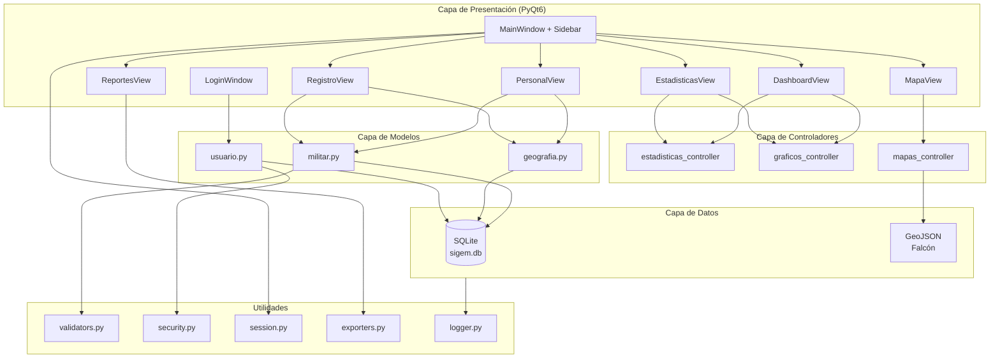
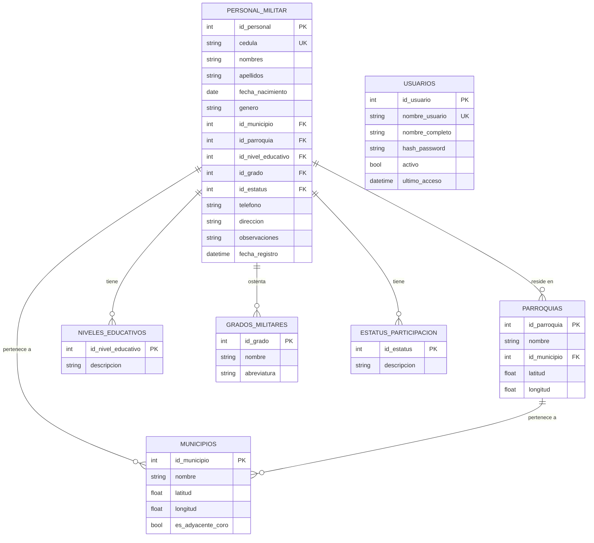
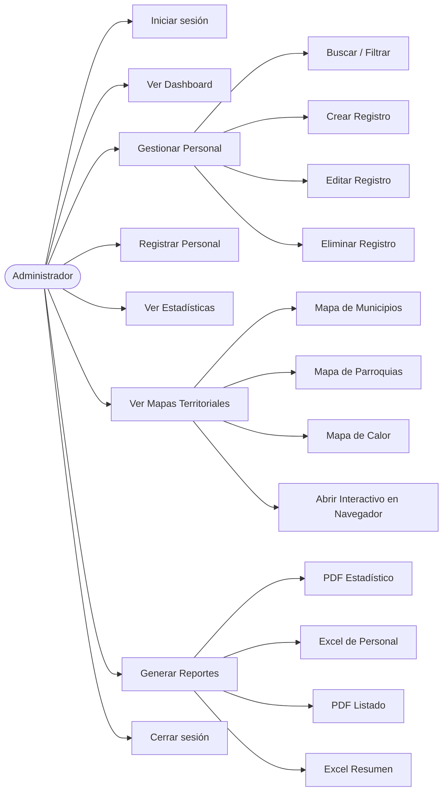
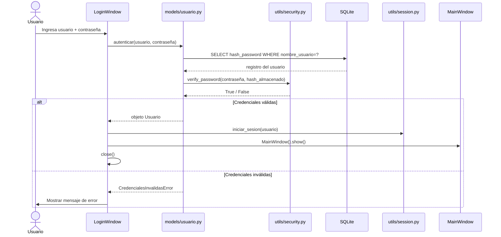
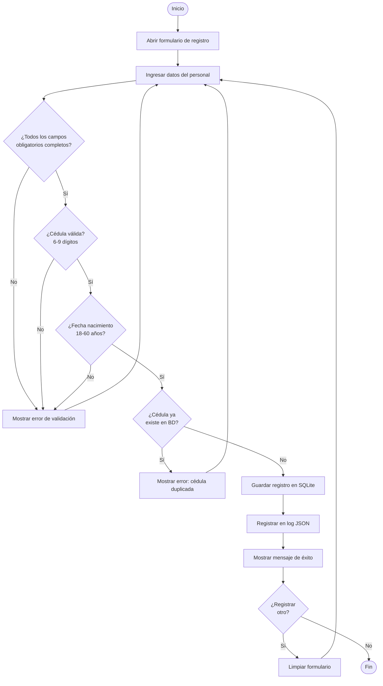

# SIGEM — Sistema de Análisis Estadístico y Territorial

**Batallón de Infantería Mecanizada "Cnel. Atanasio Girardot"**  
Coro, Estado Falcón — República Bolivariana de Venezuela

[](https://github.com/GGGilbert2002/sigem-/actions/workflows/ci.yml)

Sistema de escritorio para el análisis estadístico y georreferenciado de la
participación en el servicio militar, desarrollado con Python 3.14 + PyQt6.

---

## Instalación rápida

```bash
# 1. Clonar el repositorio
git clone https://github.com/GGGilbert2002/sigem-.git
cd sigem-

# 2. Instalar dependencias
py -3.14 -m pip install -r requirements.txt

# 3. Ejecutar
py -3.14 main.py
```

**Credenciales por defecto:** usuario `admin` / contraseña `admin123`

---

## Generar documentación técnica

```bash
py -3.14 -m pydoc -b
```

Esto abre un servidor local con la documentación autogenerada de todos
los módulos del proyecto (docstrings en formato Python estándar).

---

## Ejecutar pruebas unitarias

```bash
py -3.14 -m pytest tests/test_sigem.py -v
```

---

## Diagrama de Arquitectura



---

## Diagrama Entidad-Relación



---

## Diagrama de Caso de Uso



---

## Diagrama de Secuencia — Flujo de Login



---

## Diagrama de Flujo — Registro de Personal



---

## Estructura del Proyecto

```
sigem/
├── main.py                    # Punto de entrada
├── config.py                  # Configuración global
├── requirements.txt            # Dependencias
├── .env.example               # Variables de entorno (plantilla)
├── CONTRIBUTING.md            # Guía de contribución y GitFlow
├── RUNBOOK.md                 # Guía operativa y recuperación ante desastres
├── .github/workflows/ci.yml   # Pipeline CI (GitHub Actions)
├── database/                  # Esquema, conexión, migraciones y seed
├── models/                    # Acceso a datos (militar, geografía, usuario)
├── controllers/               # Lógica de negocio (estadísticas, gráficos, mapas)
├── views/                     # Interfaz gráfica PyQt6
├── utils/                     # Validadores, seguridad, sesión, exportadores, logger
├── tests/                     # Pruebas unitarias (pytest)
├── resources/                 # Datos geográficos (GeoJSON) y assets locales
└── reports/                   # Reportes generados (PDF, Excel, HTML)
```
